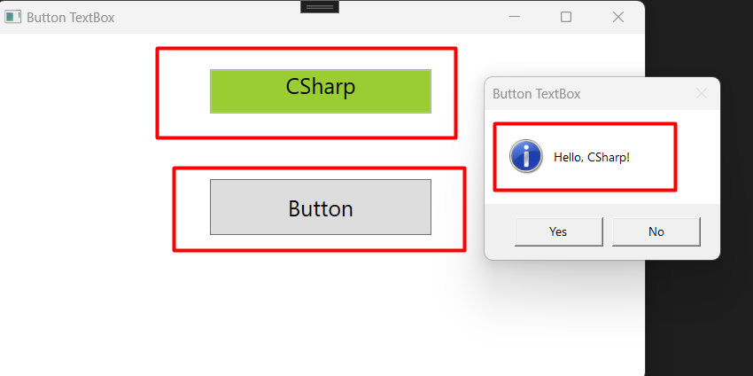
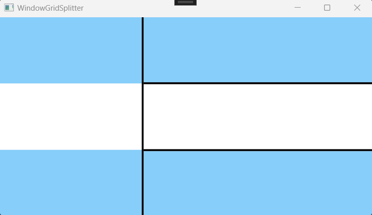

# 10. Visual Programming. Windows Presentation Foundation (WPF) Technology

## 10.1 Introduction to GUI Application Development: System.Windows Library. WPF Project Structure
- Creating a Project
- Project Components
- Interaction Logic for MainWindow.xaml
- Exploring the Main Window Component

- Importing Namespace
- Window Properties and Events
- Locating Button Events

- Events for Multi-Touch and Touch Screens
- Example 1: Event Handling
- Example 2: Event Handling
- Example 3: Event Handling
- Example 4: Event Handling

- Conclusion

## 10.2 Basic Components of WPF
- Example Analysis
- Exploring the Grid Component
- Example of Automatic Grid Creation
- Example of Manual Grid Creation

- Exploring the Button Element
- Creating Multiple Windows within a Project
- Exploring the StackPanel Container

- Exploring the Canvas Container

- Exploring the GridSplitter Container

- Exploring the TextBlock Component
- Exploring the Label Component
- Exploring the Padding Component
- Exploring the RadioButton Component
- Exploring the TextBox and Slider Components

- Conclusion

> What is Binding?
> Binding, or data binding, means that there is a "source-receiver" pair for your data. The source is always a field in one of your classes, and the receiver is a user-visible interface element.
> By binding a field from your class to an interface element, you can automatically display the content of your field on the screen.

## 10.3 Application Resources
- Example 1: Displaying an Image in the Application

- Implementation of Tab Switching

- Description of Resources at the Application Level
- Example 2: Specifying a Set of Components
- Example 3: Applications with Navigation

- Exploring Grid and Button
- Exploring Frame
- Consequences of Skipping Page

- Example 4: Dynamically Changing Data
- Specifying Display Templates
- Implementation of Display Variant in Margin
- Data Formatting

- Conclusion

## 10.4 Accelerated Development of Windows Applications with GUI
- Connecting a Repository from the First Project
- Example 1: Implementing ListView
- Running and Checking Code
- Example 2: Analyzing the Structure of MessageLog
- Analyzing the Structure of TelegramBotClient Class
- Exploring ListBox, GroupBox, and StackPanel Components
- Analyzing ObservedCollection Collection
- Analyzing MessageLog Instance
- Retrieving Selected Item
- Analyzing the Code Structure of TelegramMessageClient
- Demonstration of the Snoop Program
- Conclusion
