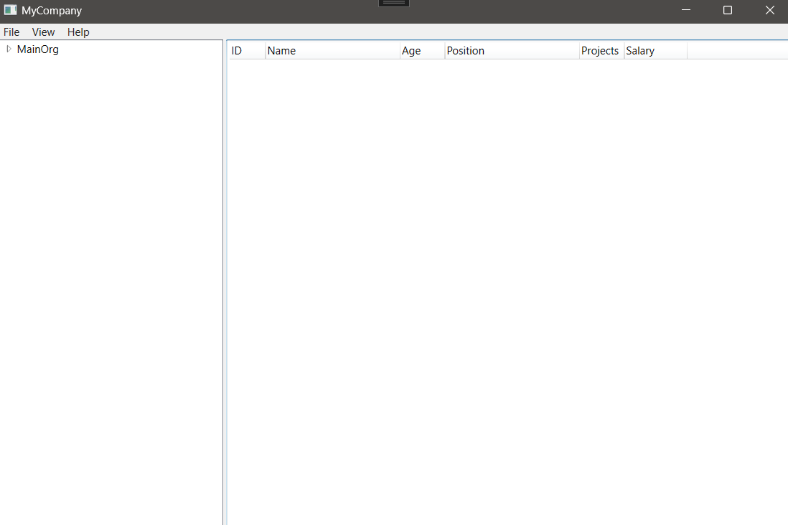
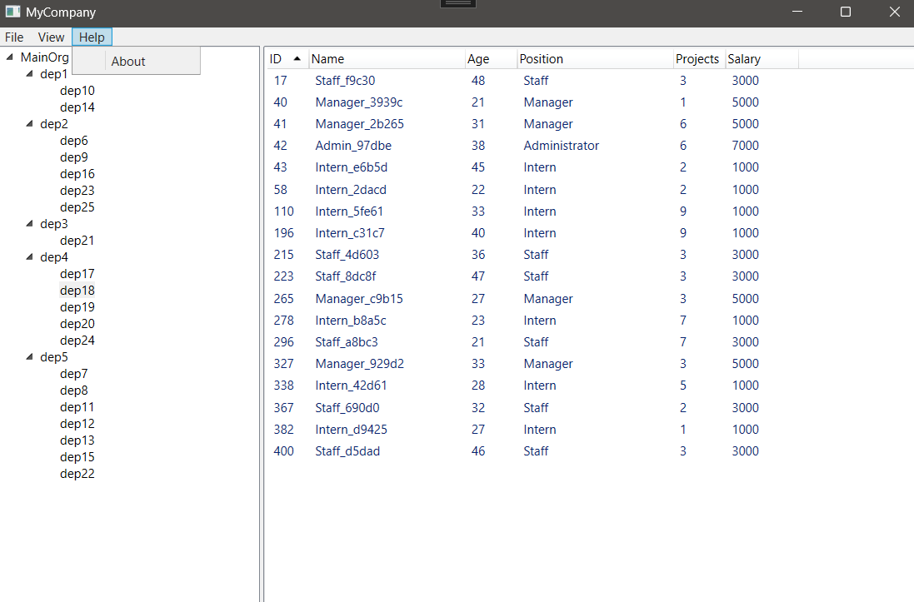

# Corporate Hierarchy Management System

## Design an information system to work with the following structure:
- Organization with departments and employees.
- Populate employees and departments automatically from a file, preferably in *.xml or *.json format.

## Employees are divided into several groups based on positions and salaries:
1. Managers (e.g., Director, First Deputy Director, Department Head).
2. Workers.
3. Interns.

The payment for interns is fixed and determined upon hiring (e.g., $500 per month).
For workers, the payment is hourly and determined upon hiring (e.g., $12 per hour).
Managers' payment is 15% of the total amount paid to all employees in their department, but not less than $1300.

## Organization Structure:

```
- OAO "Best Coders"
    - Department_1
      - Department_11
      - Department_12
    - Department_2
      - Department_21
      - Department_22
      - Department_23
      - Department_24
    - Department_3
      - Department_31
    - Department_4
      - Department_41
      - Department_42
      - Department_43
      - Department_44
      - Department_45
      - Department_46
      - Department_47
      - Department_48
    - Department_5             (Head: Manager_5)
      - Department_51          (Head: Manager_51)
        - Department_511       (Head: Manager_511)
          - Department_5111    (Head: Manager_5111)
            - Department_51111 (Head: Manager_51111)
              - Employee 1
              - Employee 2
              - Employee 3
              - Intern 1
              - Intern 2
            - Department_51112
            - Department_51113
            - Department_51114
          - Department_5112
          - Department_5113
        - Department_512
      - Department_52
        - Department_521
        - Department_522
        - Department_523
      - Department_53
        - Department_531
      - Department_54

```

## Employee Payment:
- Interns: Fixed payment (e.g., $500 per month).
- Workers: Hourly payment (e.g., $12 per hour).
- Managers: 15% of the total payment to all employees in their department, but not less than $1300.

## Structure of the Organization:
- Organization: Consists of departments organized into departments.
- Each department and unit has its own head.
- The Director leads the Organization.

## Add the ability
- To modify
- To delete
- To edit
- To sort
- Instances of Worker and Department

## Implementation and Demonstration
- Implement and demonstrate the operation of the information system.
- Display the results in the console or using a UI.


# Result (UI) WPF







