# Banking Operations Platform

Learn to use type parameterization, develop a prototype of a banking system using WPF.
This project aims to develop a prototype banking system that manages client accounts, focusing on account operations such as opening, closing, and transferring funds. 
The use of generics and parameterized classes enhances flexibility and efficiency in managing different types of accounts and clients. 
Additionally, implementing a graphical interface ensures user-friendly interaction with the banking system.

## Project Description

The Banking Operations Platform is a prototype of a banking system designed to efficiently manage clients and client accounts.  
The system facilitates various operations including fund transfers between user accounts, as well as the opening of deposits with and without capitalization.

Develop a prototype of a banking system for Bank "A", which contains information about clients and their accounts. Any client's account can be managed as follows:

- Opening and closing accounts
- Making transfers between accounts

Using generics and parameterized classes, implement methods for opening and closing accounts, as well as transferring funds between client accounts.

Accounts can be of two types:

- Non-deposit
- Deposit

A client can have two accounts, one of each type, with the ability to deposit funds into the selected account. Using a covariant interface, implement methods for depositing funds into the account according to its type.

Continue adding functionality to the program. Using contravariance, implement a method for transferring funds between clients.

## Capitalization Examples

- **With Capitalization:** If 100 units are deposited at a 12% interest rate, after 12 months the amount becomes 112 units.
- **Without Capitalization:** If 100 units are deposited at a 12% interest rate, the balance remains 100 units regardless of time.

## Capitalization Process

```
- Initial Deposit: 100
- 01st month: 101
- 02nd month: 102.01
- 03rd month: 103.0301
- 04th month: 104.060401
- 05th month: 105.101005
- 06th month: 106.1520151
- 07th month: 107.2135352
- 08th month: 108.2856706
- 09th month: 109.3685273
- 10th month: 110.4622125
- 11th month: 111.5668347
- 12th month: 112.682503

```

## Loan Issuing

The system demonstrates the possibility of issuing loans, with considerations for using generics to enhance flexibility.

## Departments within the Bank

The Banking Operations Platform includes the following departments:
- Department for ordinary clients
- Department for VIP clients
- Department for legal entities

```
Bank
├── Department for ordinary clients
├── Department for VIP clients
└── Department for legal entities
```

## Delegate and Events

 - Add notification mechanisms using delegates and events.
 - Implement an action log that will store records of all transactions on accounts/deposits/loans.

## Exception Handling - Extension Methods

 - Create custom exceptions and add their handling to the previous project.
 - Consider using extension methods and operator overloads.
 - Extract the main logic into a separate library or libraries.

## Additionally

The system considers offering clients with a good credit history a lower loan interest rate and a higher deposit interest rate.

## Tips and Recommendations

It's up to you where and how the data will be stored when implementing the program with a graphical interface.

## What is being evaluated

- Implemented graphical interface
- Parametrized templates are used
- Presence of a constructor in the class
- Implementation of methods
- Use of a covariant interface
- Correct description of data in the class
- Presence of a constructor in the class
- Presence of a contravariant interface
- Correct description of data in the class
- Presence of a constructor in the classes


## Project Demonstration

The operation of the created system will be demonstrated to showcase its functionality and efficiency.

# Result (UI) Windows Presentation Foundation

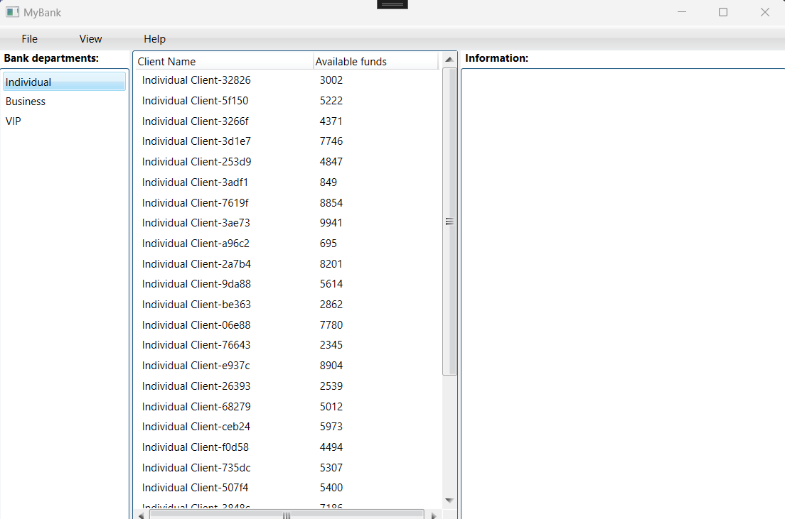

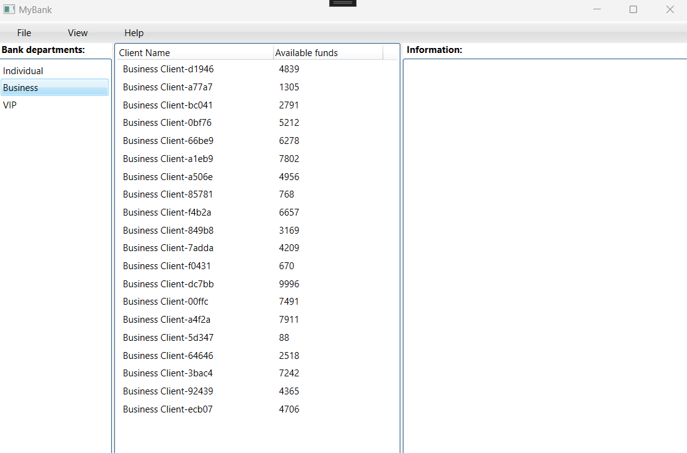

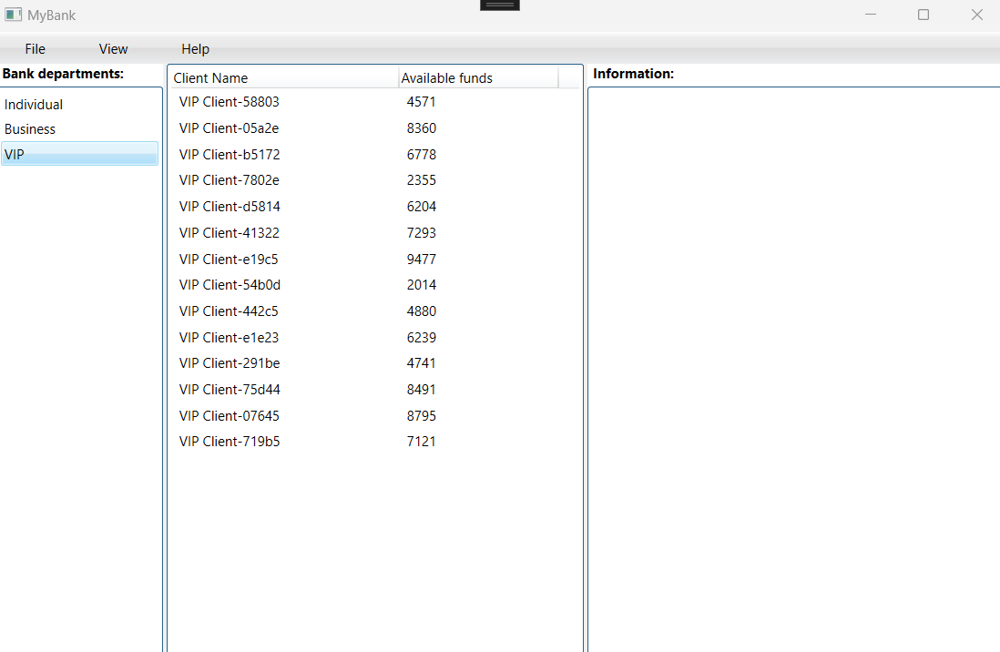

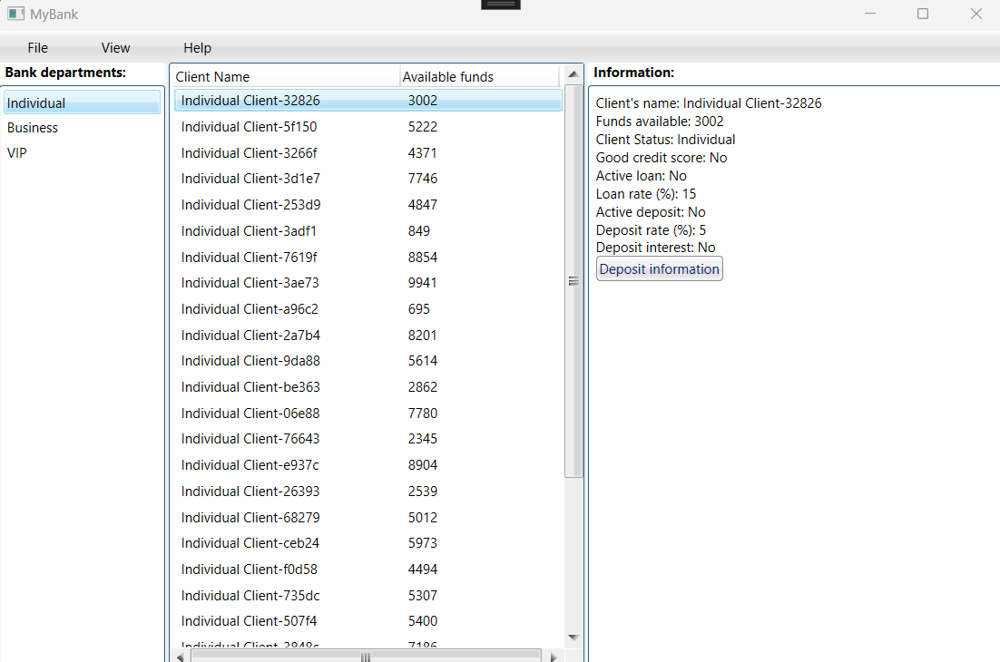

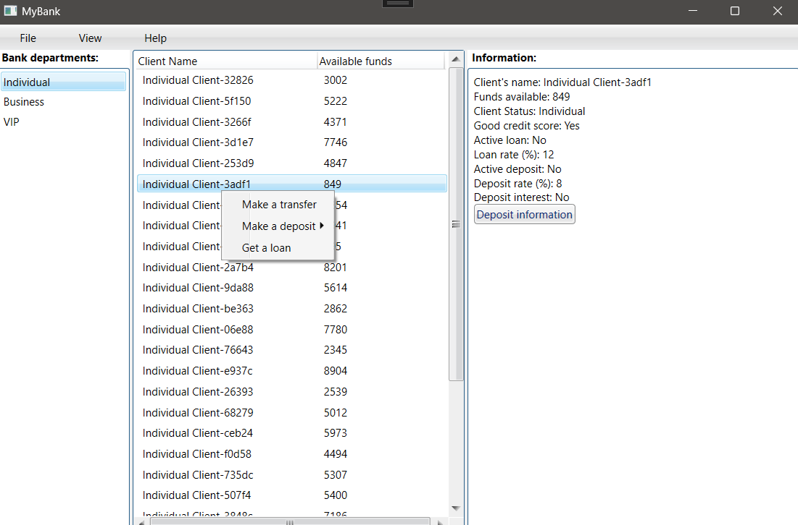

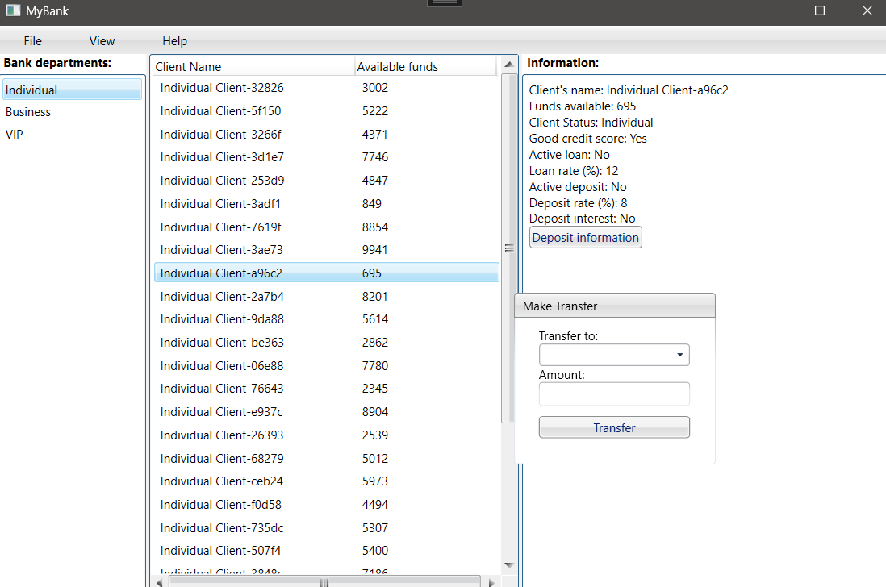

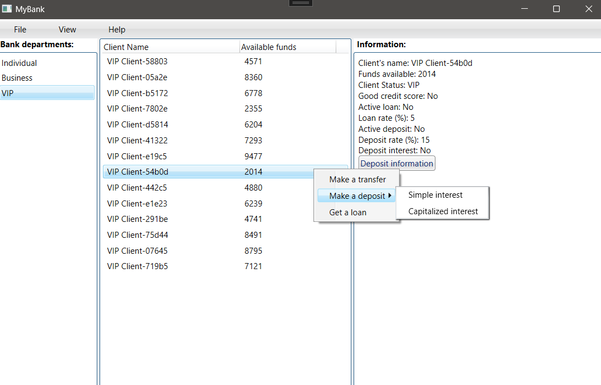

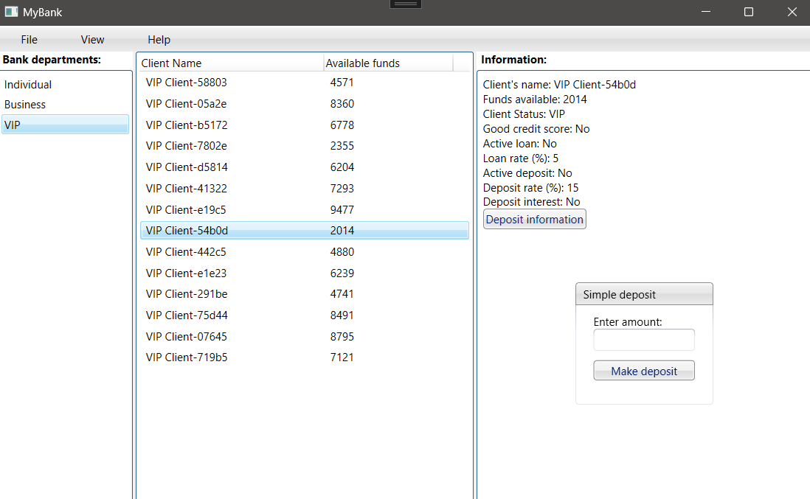

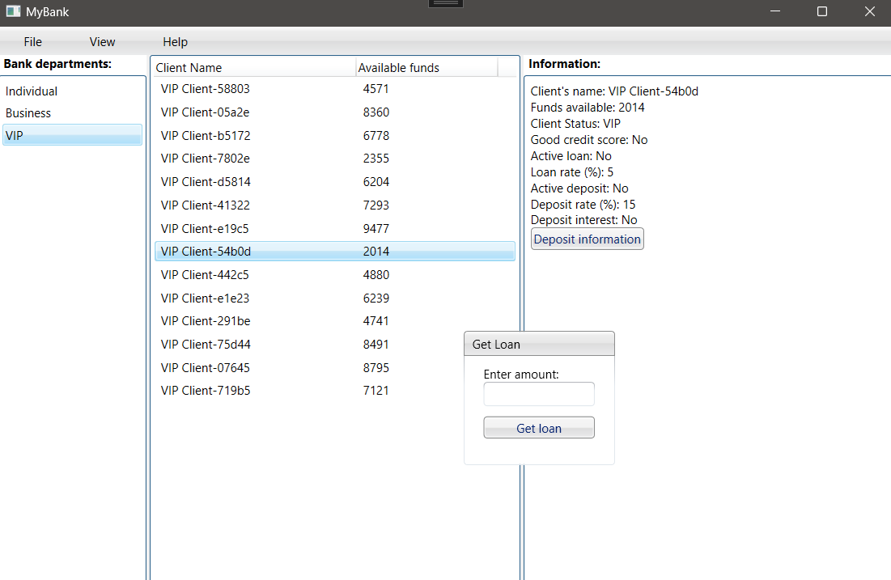

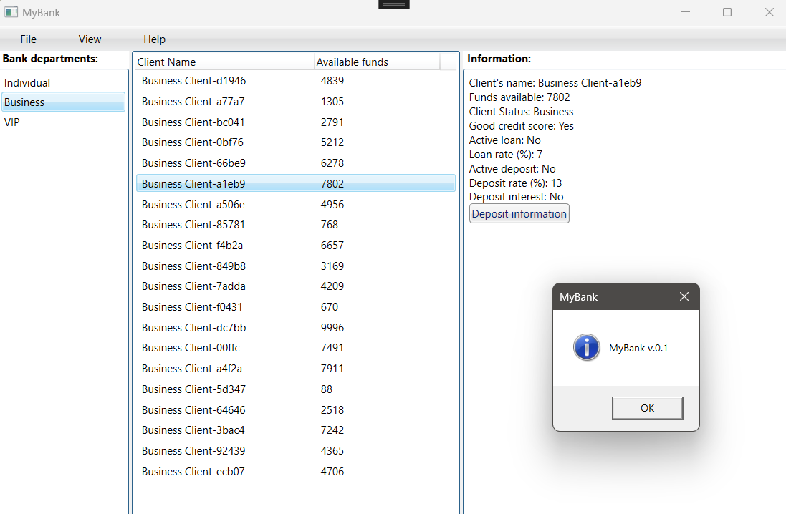

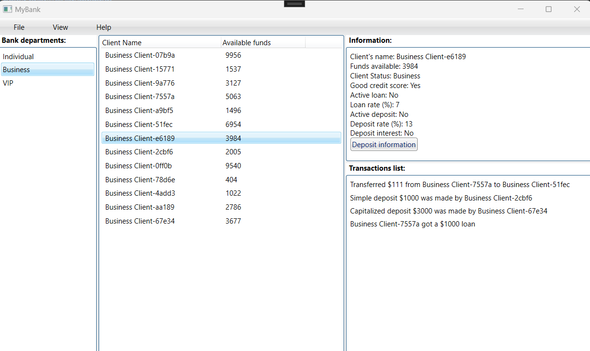
